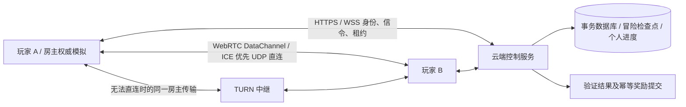

# 救援大冒险：联机、UDP 直连与存档上线设计

状态：2026-10-04 调研与实施设计。除“确认快照呈现”补丁外，下述直连、身份、云存档、迁移均未实现。本文列出交付阶段与验收门槛，不代表这些能力已经上线。

## 目标和现状

产品目标是两人合作；允许输入到画面存在延迟，但人物、物体、碰撞反馈与奖励必须来自同一个已确认的世界。局域网玩家应尽可能直接通信。换设备、刷新、掉线、服务器重启应有明确的恢复点与保存状态。

当前代码事实：

| 部分 | 当前实现 | 上线缺口 |
| --- | --- | --- |
| 实时连接 | 浏览器 WSS → 云端 Node.js；60 Hz 权威模拟，20 Hz 快照 | 同一局域网仍往返云端；没有 WebRTC、STUN、TURN |
| 呈现 | 原版本本机预测、远端外推及误差平滑；本次补丁改为确认快照插值 | 新策略需在高延迟、抖动、碰撞及真实设备上验证 |
| 单人存档 | `profile.js` 的 localStorage；区域起点保存，重玩不重复计入区域中途所得 | 不跨设备；清理浏览器数据即丢失；没有账号恢复 |
| 联机存档 | `game.js` 的 `save()` 在联机时直接返回；`server.mjs` 的 rooms Map 只在内存 | 联机进度不持久化；进程重启失去房间 |
| 重连 | sessionStorage 保存房间座位凭据；断线暂停，最多等待 120 秒 | 这是临时重连凭据，不是玩家身份或持久存档 |
| 代理识别 | 浏览器测 RTT；没有系统代理读取能力 | 不应把 RTT 或相同公网 IP 当成代理/LAN 的证据 |

没有适合所有游戏的“业界最优”。依据本游戏的目标，推荐先稳定现有云端确认快照，再逐步引入房主权威的 WebRTC 直连。竞技排名、交易和付费奖励需要另一条服务端可信验证路径。

## 推荐结构

传输与权威分离：切换直连/TURN 不改变权威房主。现有云端模拟模式仍是独立可选模式。不能只把两个浏览器连起来而继续让动作等待海外云端判定，那样不会解决局域网的动作延迟。

首版允许在建房时选择已经验证可用的模式。开始后若 UDP 无法保持连接，暂停并切到 TURN；再失败则结束传输恢复流程，提供从云检查点重建的入口。自动从房主模拟切到云模拟要等完整状态交接实现后才启用，不能在双端继续运行时直接切换权威。

### UDP 与消息分类

普通网页不直接创建原始 UDP socket。WebRTC DataChannel 使用 SCTP / DTLS / ICE，通常通过 UDP；TURN 也可能选择 TCP/TLS。应按实际协商结果展示，不能承诺所有网络永远使用 UDP。

| 通道 | 建议配置 | 应用层约束 |
| --- | --- | --- |
| 高频完整动态快照 | `ordered:false, maxRetransmits:0` | `authorityEpoch + tick + schemaVersion`；只收当前权威的新 tick；丢掉旧帧；每帧可独立解码 |
| 移动输入 | 无序有限寿命，初始实验 `maxPacketLifeTime:100` 毫秒 | sequence、目标 tick、ack；重复最近未确认输入，有界窗口；不能把缺号直接当作执行完毕 |
| 跳跃/抓取/投掷等边沿 | 独立命令 ID 与 ack，超时重发；可先用可靠有序控制通道 | 权威只执行一次；等待确认，不能因补发重复投掷或奖励 |
| 开始/暂停/过关/权限交接 | 可靠有序 DataChannel，加应用层请求 ID 和状态版本 | 先验证权限，响应是成功/失败/已执行；防止旧命令跨 epoch 生效 |
| 存档与身份 | 认证 HTTPS；云端事务提交 | revision 条件写入、幂等键、成员权限、服务端确认；发送成功不代表保存成功 |

`maxRetransmits` 与 `maxPacketLifeTime` 不同时设置。可靠通道和不可靠通道仍共享底层拥塞与设备资源；大存档走 HTTPS，不向实时 DataChannel 无界塞入数据。限制 `bufferedAmount`、包大小、输入速率和队列长度；持续输入过期时先置为中立，再暂停，防止断线后人物继续跑。

不能原样复用当前 WSS 输入队列来处理无序 UDP：目前服务器把更小 seq 视为重复而跳过，不证明缺失输入已经处理。新协议必须明确连续 ack 或选择性 ack、边沿去重，以及缺失 tick 的中立/短期保留策略。先用带丢包和乱序的协议测试验证，再切传输。

静态地图通过可靠通道确认版本并加载完毕后，才接受动态快照。当前 `net-codec.js` 每帧相对构造默认值编码，有利于丢帧恢复，但仍依赖已收到的关卡描述。中途加入需先完成完整基线/校验和握手。

### 直连建立、路径诊断与代理

1. 认证身份进入私有房间；服务端校验成员，签发短期房间信令授权与 TURN 凭据。
2. 通过现有 WSS 交换 SDP 和 trickle ICE 候选；尝试本地候选、STUN 得到的公网候选及 TURN 中继。
3. 使用 `getStats()` 的 transport `selectedCandidatePairId`，查询 local/remote candidate 的类型、protocol、relayProtocol，并记录 RTT；DataChannel open 后做实际双向心跳。
4. UI 显示“点对点连接”“TURN 中继”“云端房间”，另显示协议/延迟和连接健康。只有有足够地址与路径证据时才标“局域网直连”；隐私限制、mDNS、VPN 存在时不强行推断。
5. 网络变化触发 ICE restart；重试有超时和上限。Wi-Fi 客户端隔离、公司 UDP 限制、移动网络、双重 NAT、IPv6/IPv4 混合都必须在验收矩阵中覆盖。

浏览器不能可靠读取操作系统 HTTP 代理或 VPN/TUN 状态。当前设备是否经过 Mihomo 可用本机连接记录调查，游戏页面本身只能可靠描述它选中的 WebRTC 候选与服务器端观测路径。普通系统 HTTP 代理与 TUN/VPN 影响 WebRTC 的方式不同；成功点对点也不证明绕过所有 VPN。

### 确认快照呈现

本次补丁只改变现有 WSS 客户端呈现，不修改房间权威或持久化：

- 固定步长发送真实输入，保留短按边沿和 seq/ack；不执行本地预测物理。
- 初始 100 毫秒快照缓冲，在收到的快照之间线性插值；这是可测试的初始参数，不是通用行业标准。之后根据实际发送频率、抖动和停帧比例调优。
- 人物、敌人、移动平台、物体和 Boss 几何共享一个历史时刻。HUD、音效和奖励也使用该确认时间线。
- 缓冲耗尽停在最后确认位置，不沿速度猜测未来；插值播放时间只向前移动。
- 重生、受伤、搬运所有权切换及关卡/epoch 切换不混合成虚构中间状态。
- 本机镜头跟随已显示人物。真实被撞退或重生仍按权威显示，不能为消除“后退”而隐藏游戏规则中的真实位移。

直连后仍保留此策略；较低实际 RTT 才能降低输入至确认的延迟。仅从 TCP 换成 UDP，不会自动修复预测误差、渲染降画质或服务器的错误判定。

## 身份、存档与奖励

### 三种独立数据

| 数据 | 标识与归属 | 保存与冲突策略 |
| --- | --- | --- |
| 个人档案 | `playerId`：解锁区域、个人最佳成绩、个人设置 | 通关解锁与双方个人进度分别提交；解锁集合合并、最好成绩取可信最大值；设置独立版本，不能整档盲合并 |
| 共同冒险 | `adventureId`：两名成员、角色绑定、共同地图、资源、检查点 | 单一 revision 与提交权；两个设备的分支需用户选择恢复点，生命/消耗资源不能简单取最大 |
| 临时房间 | `roomId`：连接、座位、准备、权威 epoch/租约 | 可失效；不能充当持久玩家身份。重新建房可载入共同冒险，不依赖旧房号仍存在 |

默认设计：两人都获得个人通关解锁；共同冒险单独保留。联机共同资源与角色生命不会覆盖各自的单人冒险。当前用户尚未明确选择其他归属模式，实施云存档前保持此默认并在产品流程中说明。

允许访客进入，但要清楚提示“仅此设备可恢复”。提供绑定可恢复身份的入口，绑定后跨设备继续；清除浏览器数据且没有绑定账号的匿名用户不承诺找回。认证 session 使用安全 Cookie 或等效受控机制，不把房间 token 当成账号，不把长寿命高权限凭据写入日志。

### 检查点与事务提交

首个上线版本采用明确的区域起点与过关检查点，沿用现有单人防重复收益的规则。运行中的完整快照用于短时重连/迁移；持久恢复可以回到最近检查点，不能标为任意帧无损恢复。UI 展示保存时间与恢复点，区分“本机待同步”“云端已保存”“保存失败”。

建议存档字段：`schemaVersion, contentVersion, adventureId, memberPlayerIds, authorityEpoch, checkpointId, revision, confirmedTick, entryTotals, campaign, createdAt, updatedAt`。迁移快照另外记录全部动态实体、对象关系、计时器、事件/实体 ID、输入状态、随机数状态（如引入）、最近 ack 及去重窗口，不混入 GPU/audio/DOM 或明文登录凭据。

提交过程：

1. 权威生成候选检查点及稳定 `commitId`，两端保存本地待同步记录。
2. 云端校验身份、冒险成员、当前 epoch/租约、基准 revision 和状态范围。生产规则决定可接受的信任级别。
3. 在同一数据库事务中追加检查点、更新共同冒险 revision，并向两名玩家记入幂等通关记录/待应用奖励；使用唯一约束保证重复请求不重复奖励。
4. 持久提交后返回新 revision 与 receipt。失去响应时用相同 commitId 查询/重试，而不是生成新奖励。
5. 发生 revision 冲突时保留双方检查点并提示选择；禁止旧设备静默覆盖新档。

本地 IndexedDB 作为缓存与待同步 outbox；浏览器存储可能被清理，且后台/关闭事件不保证执行。不能把 pagehide 的一次发送当成可靠保存。关键节点要在继续下一关前展示保存结果；云端临时失败时可明确选择继续并接受未同步风险。

### P2P 存档的信任边界

TLS/DTLS 保证传输安全，不证明房主没有改游戏。房主签名/双方确认也不能单独证明合法游戏过程。普通私人合作进度可按产品政策标记为“玩家托管进度”；排行榜、付费物品、交易余额及可兑换奖励必须走服务端验证。

若需要可信 P2P 通关，云端在后台验证版本化检查点与输入日志/事件轨迹，或将奖励限制在服务器权威模式。只有验证通过后记入可信奖励；验证能力未完成前不推出具有经济价值的奖励。不能同时承诺完全离线直连、无可信执行方和严格防作弊。

## 掉线、房主变化与服务重启

首版：任一端后台/GPU 丢失/断线都通知暂停；短断线尝试原权威恢复。房主永久离开时，提供从最近云检查点新建冒险的入口。此版本不承诺无缝迁移。

完整迁移阶段：云控制服务签发有期限的权威租约与递增 epoch；旧权威租约失效后必须停止对外权威输出。两端分区期间禁止双写。接班者获得完整已确认快照后，双方确认恢复基线，再接受新 epoch 的输入。恢复丢弃未确认动作，不重复消费/投掷/奖励。

定期把完整迁移快照送往另一端和云端，先测定大小、频率和可接受的恢复损失。不能依赖普通渲染增量帧完成迁移。服务器重启后从持久检查点重建，重新签发房间与短期连接凭据，不能恢复已经撤销的旧租约。

纯局域网离线模式必须作为单独的产品模式：双方设备持有本地共同冒险副本，明确标为“离线/未同步”，不承诺云端自动迁移、防双写或可信奖励。恢复联网后按 revision 解决分支。首版保持云控制连接；租约或身份校验不可用时暂停，不能暗中退化成另一套存档规则。

## 上线运维与验收

| 领域 | 必须完成的验收 |
| --- | --- |
| 准确性 | 两个真实浏览器的按键、松键、转向、跳跃、撞墙、移动平台、搬人/抛箱/Boss；无预测跑过头再回拉；真实受击位移保留；HUD/音效不提前 |
| UDP | 0/1/5/10% 丢包、乱序、重复、100–500ms 抖动、带宽限制；松键不持续跑；动作不重复；无序序列不吞动作；缓冲/队列有上限 |
| 路径 | 两台不同局域网设备、AP 隔离、跨网、UDP 禁用、TURN UDP/TCP/TLS、系统代理和 TUN/VPN；记录实际候选对与连接成功率 |
| 断线 | 刷新、后台、网络切换、房主退出、ICE restart、控制服务失联、双方分区；始终最多一个权威；恢复点明确 |
| 存档 | 双方独立账号、访客绑定、跨设备冲突、断电/进程终止、数据库异常、重复/乱序提交；已确认档恢复、未确认档不冒充成功 |
| 版本 | 旧客户端与新服务端握手、关卡版本匹配、存档迁移与回滚；不兼容时暂停更新，不静默套用旧地图 |
| 安全 | 房号枚举限速、成员授权、重连凭据撤销、信令验证、TURN 短期认证、防开放中继、包大小/速率限制、存档越权与重放 |
| 性能 | 低端手机和两台不同桌面设备的实际 FPS/分辨率、内存、CPU、快照带宽及摄像机行为；浏览器自动化同机测试不能代替真实 LAN 验收 |
| 运维 | 数据库备份并演练恢复、指标报警、容量/费用上限、渐进开关和回滚；日志不记录 token、完整 ICE 地址或不必要的个人信息 |

观测指标：输入→首次确认画面时间、快照年龄、抖动/停帧率、selected candidate 类型与 RTT、连接建立时间、直连/TURN 比例、重连成功率、保存确认延迟/失败/冲突、恢复丢失的检查点间隔。DataChannel 丢包通过应用序列统计，不能照搬 RTP 音视频统计。

发布前制定明确的延迟/恢复目标，以两台实际 LAN 设备测量；初始实验目标为 LAN p95 输入至确认画面小于 150ms，采用现有 100ms 缓冲会限制这个目标，需实测后降低缓冲或提高快照频率。此数值是本项目验收候选，尚未实测，不是当前能力承诺。云模式按路径 RTT 展示真实延迟。

## 实施次序与交付边界

1. **准确性补丁**：确认快照统一呈现、保留现有 WSS 权威，验证止步/抖动/碰撞/生命周期；仅此前端补丁具备单独部署条件。
2. **持久化基础**：身份、冒险数据模型、事务检查点、outbox 与 revision、双方通关归属、本地旧档导入；重启/冲突/备份恢复验收后才承诺云存档。
3. **UDP 协议和 WebRTC**：可靠控制/不可靠快照、乱序输入 ack、信令/ICE/TURN、候选诊断；先测试房主权威，不在旧云模拟旁运行第二个权威。
4. **实际 LAN 灰度**：两台不同设备验证直连、代理/TUN、松键和存档；失败回退到已验证模式；逐步扩大流量。
5. **迁移和可信奖励**：完整状态交接、epoch/租约、防分区双写；需要可信排行/奖励时增加云验证。此前产品明确仅支持检查点恢复。

这些阶段需要分别可回滚，不能一次替换实时传输、权威与存档再直接上线。当前数据库、账号提供方与 TURN 部署尚未选定；优先复用现有 1Panel 管理体系，新增公网服务前核实网络/证书/容量，不能绕过现有生成配置管理。

## 依据

- [IETF RFC 8831：WebRTC DataChannel，SCTP/DTLS/ICE/UDP，可靠与不可靠游戏消息](https://www.rfc-editor.org/rfc/rfc8831.html)
- [WebRTC：建立 ICE PeerConnection](https://webrtc.org/getting-started/peer-connections)
- [W3C WebRTC Stats：选中候选对与 RTT](https://www.w3.org/TR/webrtc-stats/)
- [Snapshot Interpolation：历史快照缓冲及外推的局限](https://gafferongames.com/post/snapshot_interpolation/)
- [Client-side Prediction / Server Reconciliation：预测必须面对权威纠正](https://www.gabrielgambetta.com/client-side-prediction-server-reconciliation.html)
- [Unity Cloud Save：write lock 与并发冲突](https://docs.unity.com/en-us/cloud-save/concepts/write-locks)
- [Unity Authentication：匿名身份绑定与恢复限制](https://docs.unity.com/en-us/authentication/anonymous-auth-and-linking)
- [PlayFab：Player Data 的读写信任边界](https://learn.microsoft.com/en-us/gaming/playfab/player-progression/player-data/)
- [Photon Fusion：迁移需重建状态与输入权限](https://doc.photonengine.com/fusion/v2/technical-samples/fusion-disconnect-reconnect)

以上资料用于协议/机制依据；本游戏的房主选择、缓冲参数、检查点粒度和交付阶段是根据产品需求作出的设计判断。
