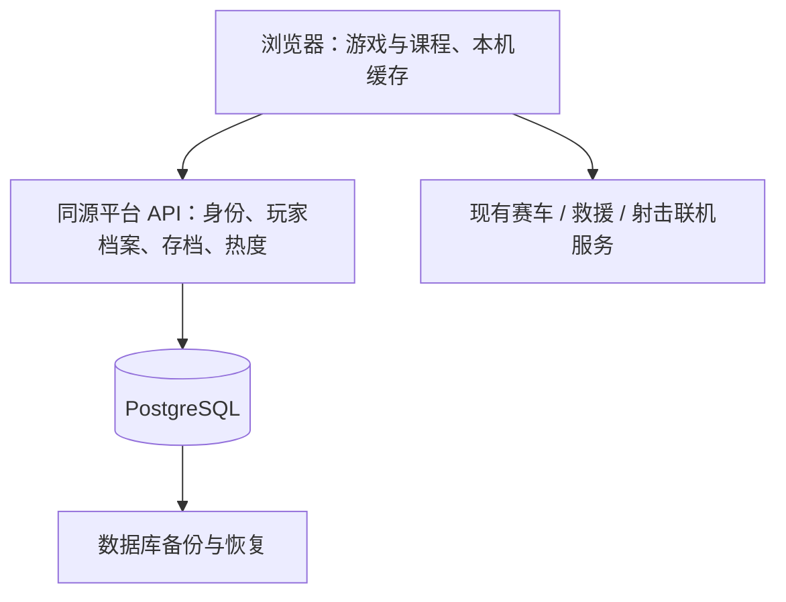

# 游戏厅账号、云存档与热度榜调研方案

日期：2026-10-04。现有源码基线：`6c27023`，仓库 `rarest/kids-games`。本文件记录调研时的现状与建设方案；阶段执行结果见同目录下的实施计划。账号、云存档仍属于后续阶段。

## 建议

保留不注册即可游玩的入口，增加可选的家长账号和多个孩子的独立档案。所有游戏共用身份、存档服务和管理后台；每款游戏保留自己的存档格式、金币与道具。优先接入英语学习进度，再分批接入其他游戏。

推荐在现有服务器上增加一个 Node.js 平台服务，使用 Better Auth 处理登录会话，PostgreSQL 保存身份、进度和热度数据。现有静态页面与赛车、救援、射击联机服务继续各自运行。新增游戏通过稳定的 gameId 和存档适配器接入，增加教材通过稳定的教材、单元、课程 ID 接入。

不把注册作为打开游戏、参加六位码房间或计入热度榜的前提。六位房间码只用于加入一场游戏，不作为账户密码、玩家 ID 或长期存档凭据。

## 已核对的现状

游戏目录 `games.js` 有 14 款游戏。没有统一注册、登录或账户归属；长期存档主要保存在当前浏览器。联机服务器负责即时房间，并不是账户数据库。

| 游戏 | 当前保存内容 | 刷新后的恢复范围 | 主要源码证据 |
|---|---|---|---|
| 英语学习乐园 | 课程完成、错题、复习安排、当前学习步骤；探险另有金币、皮肤和现场 | 课程步骤和探险现场可继续 | `english/course-ui.js`、`english/course-engine.js`、`english/core.js` |
| 记忆花园 | 金币、道具、关卡、纪录、完整牌局 | 可以继续未完成牌局 | `memory/profile.js`、`memory/core.js` |
| 合成4096 | 金币、道具、分难度纪录、牌堆和当前牌局 | 可以继续未完成牌局 | `merge4096/save.js`、`merge4096/game-core.js` |
| 峰谷竞速 | 金币、车库、皮肤、胜场、赛道纪录 | 恢复车库与纪录；比赛现场不恢复 | `racing/core.js:518` |
| 松鼠大作战 | 战役区域、解锁、分数、生命、最高分、设置 | 从保存区域入口继续；不恢复区域内现场 | `rescue/profile.js`、`rescue/game.js` |
| 星际小队 | 单人小关入口、生命、武器升级、分数、最高分 | 单人从小关入口继续；联机不保存此检查点 | `shooter/core.js:159`、`shooter/game.js` |
| 微光跑酷 | 金币、服装、已完成关、最好时间、自创关卡 | 恢复成长档案和编辑关卡；不恢复正在跑的现场 | `parkour/profile.js`、`parkour/wardrobe.js`、`parkour/editor.js` |
| 皇冠迷宫 | 金币、道具、皮肤、关卡旅程、星级、最少步数 | 继续关卡旅程；不恢复局内位置或已炸墙壁 | `maze/save.js`、`maze/main.js` |
| 纸片领地 | 金币、钻石、皮肤、累计分、胜场、奖励收据 | 恢复成长档案；不恢复当前领地与位置 | `territory/profile.js`、`territory/game.js` |
| 大鱼吃小鱼 | 本地成绩、名字、声音设置 | 仅成绩与设置 | `games/fish.html` |
| 贪吃蛇 | 最近三局分数 | 仅历史成绩 | `games/snake.html:429` |
| 黄金矿工 | 最高累计开采分 | 仅最高分 | `goldminer-sites/App.tsx:346` |
| 捕鱼达人 | 金币、炮级、捕获数只在内存 | 刷新重新开始 | `games/fishing.html:323` |
| 拼音打字 | 模式、分数、生命、关卡只在内存 | 刷新重新开始 | `games/pinyin.html:530` |

本机保存不等于云存档：更换设备、浏览器、网站域名或清除网站数据时，无法自动取得原记录。旧域名的浏览器存档也不能由新域名直接读取。

服务器已核对为 4 核、约 24 GB 内存，约 160 GB 可用磁盘；当前列出的 Docker 容器没有 PostgreSQL。资源足以部署这里建议的基础服务，但这不是负载测试结果。

## 用户怎么使用

1. 打开首页就能玩。支持存档的游戏先为游客保存在本机，并明确显示“保存在此设备”；仅保存成绩或不支持续玩的游戏说明具体范围。
2. 家长可以选择注册。建议第一版用家长邮箱和密码，提供邮箱验证、找回密码；邮件真实送达后才开放相关入口。
3. 一个家长账号可创建多个玩家档案，只需昵称和预置头像。孩子无需各自填写邮箱或记一套密码。
4. 登录后选择当前玩家。每款游戏、每本教材的进度都属于这个玩家；兄弟姐妹不会共用余额、错题或关卡。
5. 首次登录发现已有本机存档时，说明导入内容，并让家长选择归属的孩子。保留原本机副本，重复登录不会重复导入。
6. 已登录玩家在已接入云存档的游戏中，换设备后可以继续已保存的进度。网络断开时保存到本机，恢复网络后同步；页面显示“已同步”“待同步”或“存在两个进度”，不能保存失败却显示成功。没有局内存档能力的游戏仍从新一局开始。
7. 切换玩家前先保存支持保存的内容、退出当前对局，再加载目标玩家档案；不能保存当前局的游戏明确提示切换后重新开始。退出家长账号后不把其存档留给新游客继续覆盖。

管理账号、删除档案、导出记录放在家长页面。昵称和头像切换属于方便共用设备的功能，不把它包装为孩子之间的安全隔离；若需要独立设备访问权限，后续另加明确授权方式。

## 技术选择依据

| 方案 | 适合之处 | 此项目的取舍 |
|---|---|---|
| Node.js + Better Auth + PostgreSQL | 复用现有 Node 环境；身份与业务数据分开；数据库支持后续多实例服务 | 推荐。需要自行完成玩家档案、同步逻辑和管理页面 |
| Node.js + SQLite | 单机、小规模场景简单有效，部署维护少 | 仅做热度榜也够用；考虑账号、学习和多服务持续增长，建议直接用 PostgreSQL |
| Supabase | 已有认证、PostgreSQL、数据权限和管理工具 | 可选，但自托管是一组服务。当前已有联机服务，初期不需要为此再引入整套实时、存储等组件 |
| PocketBase | 单个程序，内置 SQLite、认证和管理页面，起步方便 | 官方说明 1.0 前兼容性仍会变化，可能需要手动迁移。这里优先选择便于长期扩展的组合 |

SQLite 并非“只能做玩具”：官方说明它适用于很多低中流量网站，但同一数据库同时只有一个写入者。推荐 PostgreSQL 是基于本项目将增加统一身份、同步和多个业务写入的判断，并非当前已经出现容量不足。

Better Auth 提供账号认证与管理 API，不会自动生成本站需要的家长中心或运营后台。匿名身份插件能支持游客转正式账号；使用时必须自行迁移业务数据，默认匿名账户删除行为也要纳入事务设计。初期游客仍可只用本机存档和匿名统计标识，避免每次访问都建立云端账户。

第一版不引入短信、微信扫码、Redis、微服务拆分或统一全站金币。以后根据实际用户需求和运行指标增加。

## 数据与服务结构

一个数据库按表区分业务，不为每款游戏分别开数据库。

| 数据 | 建议结构 | 要解决的问题 |
|---|---|---|
| 身份 | 认证库管理的 users、accounts、sessions、verification | 登录、验证、找回与退出会话 |
| 玩家档案 | `player_profiles(id, owner_user_id, nickname, avatar, created_at)` | 一个家长管理多个孩子；服务端检查档案归属 |
| 游戏目录 | `games(id, name, enabled, save_schema_version)` | 稳定 ID，不因名字、链接参数改变而重置记录 |
| 游戏存档 | `game_progress(profile_id, game_id, schema_version, revision, data, updated_at)` | 每玩家每游戏一份当前文档；revision 阻止旧设备覆盖 |
| 学习事件 | `learning_events(event_id, profile_id, content_id, content_version, result, occurred_at, received_at)` | 按题目与课程 ID 保存尝试，支持错题、复习和未来教材扩展 |
| 导入记录 | `save_imports(import_id, source_id, profile_id, game_id, original_snapshot, imported_at)` | 一次导入、留存原始副本、明确档案归属 |
| 有效游玩 | `play_sessions(session_id, actor_key, game_id, started_at, qualified_at, active_seconds)` | 热度统计和重复提交去重 |
| 热度汇总 | 按日期与游戏的次数、时长汇总；周期访客数从参与者去重记录计算 | 日 / 周 / 月榜，周月访客数不能简单相加日访客数 |
| 钱包流水 | `game_transactions(transaction_id, profile_id, game_id, operation, receipt, created_at)` | 日后需要同步金币与道具时，购买、消耗、奖励只结算一次 |
| 后台操作 | `admin_audit(id, admin_id, action, target_id, created_at)` | 追查禁用、重置、恢复等管理操作 |

JSONB 保存各游戏不同的进度结构；身份归属、版本号、游戏 ID 与索引列单独建字段。学习事件和游戏事件都使用唯一 eventId。余额相关更新在数据库事务中完成。

平台服务通过站点同源 `/api/` 接入；数据库不开放给浏览器，也不放在静态网站目录或 Git 仓库里。账户会话采用认证库的安全 Cookie，业务 API 仍逐次验证玩家档案归属。联机重连凭据不上传到云存档或热度事件。

## 云存档规则

每个游戏提供 `readLocal`、`validate`、`import`、`merge`、`apply` 适配器，只读取允许的存档键。不能把整个 localStorage 原样上传。

| 内容 | 同步办法 |
|---|---|
| 已完成关卡、已解锁课程 | 按稳定 ID 合并；拥有物品的合并必须配合有效导入或购买记录 |
| 最佳成绩 | 按明确规则取最好；时间与步数等关联纪录保留同一次完整成绩，不能拼出从未取得的成绩 |
| 学习尝试、错题、复习 | 用学习事件去重；同一词句的复习安排根据事件重新计算，不简单取最大日期 |
| 当前牌局、战役入口、探险现场 | 保存整体版本；两个设备各自推进时保留冲突副本，让玩家选择继续哪份 |
| 金币、道具、累计次数 | 不把两份余额相加或取最大；重复奖励、消费与重试使用唯一操作收据 |
| 自创关卡 | 保留版本和冲突副本，避免覆盖另一台设备的创作 |
| 画质、音量、按键 | 优先留在设备；适合手机的画质无需跟随电脑同步 |

例如：电脑从 100 金币花掉 30，手机还保留 100；若用“取最大值”同步，就会把已经花掉的 30 金币恢复。又如两个设备都有相同的通关奖励，直接相加会领两次。这是逐游戏接入的原因。

首次导入的客户端档案只证明“设备上传了这些记录”，不证明分数或余额真实。唯一流水可以防止重试重复结算，但不能证明浏览器自行生成的奖励有效；若以后做玩家竞技成绩榜，需要单独建设可信成绩验证。当前要做的是游戏热度榜。

第一批云同步优先英语课程的完成、尝试、复习与当前步骤。金币较复杂的游戏先保留本机钱包，完成导入和交易规则后再开放钱包云同步；不能用统一覆盖接口假装所有游戏已接入。

启用云钱包后，购买、兑换和消耗云端道具需要联网确认；离线仍能继续基础玩法和学习，但不能在两台设备上各自花掉同一份云余额。关卡奖励可暂记为待确认，验证通过后才入账。尚未接入云钱包的游戏保留原本机规则。唯一操作 ID 只防止重复执行，余额不足、物品数量和奖励资格仍须服务端在同一个事务中验证。

恢复旧对局或选择冲突副本时，也不能恢复已经消费的云道具。局内存档记录关联的消费收据，载入时核对现有钱包与已使用效果；不兼容的现场保留为副本，不能自动重放奖励或把库存写回过去。

保存用客户端已知 revision 进行条件更新。版本不一致返回冲突和当前版本；本机待提交队列不因一次网络错误被清空。迁移前保留副本，删除档案有明确删除标记，旧设备不能在下一次同步把已删档案重新建立。

## 游戏热度榜

用户要的是“哪些游戏玩得多”，不是个人分数排名。

- 首页设置日榜、周榜、月榜，以有效游玩次数排序，游玩时长作为同次数时的辅助排序。
- 默认北京时间：当天 00:00 起、本周一 00:00 起、本月 1 日 00:00 起。显示日期范围及统计开始时间。
- 真正开始游戏或课程后，前台累计游玩达到 15 秒才计一次。菜单、加载、明确暂停和隐藏页面不计；记忆观察牌面、英语答题属于实际游玩。
- 同一参与标识、同一游戏，在首次有效计数后的 30 分钟内刷新、重进或开多个标签页不重复计数。使用服务端原子去重，不使用容易在整点跨界多计的固定半小时桶。
- 达到计数条件后仍在持续玩的，每隔 30 分钟可计一个新的有效游玩段，因此展示“有效游玩次数”，不称为精确开局次数。
- 服务器确定收到时间、周期与幂等结果，限制客户端上报时长和提交频率。多人房间中每个正在玩的参与者各计一次，等待大厅不计。
- 游客通过匿名标识统计；它接近设备访客，并不等于真实人数。登录后可按玩家档案统计参与者。第一版主要展示次数和时长，不把混合访客数标成准确人数。
- 不回填虚构历史数据。未收集到记录时展示“开始统计，快来玩一局”；数据接口出错展示“暂时无法读取”，不能伪装成没人玩。
- 后续登录不会把同一次历史游玩再算一遍；登录绑定前的游客历史保留原口径，不声称能精确辨认过去跨设备的同一个人。

这套统计先采集必要的匿名游戏 ID、有效时长和时间，不要求孩子姓名、真实年龄或指纹识别。服务端去重和限流用于减少误计；纯浏览器游戏的上报本身仍可能被人工伪造，若实际出现刷榜再增加相应验证。

统计客户端统一接口 `setPlaying(boolean)` 和 `finish()`，持续维护前台有效时间；每款游戏在真正开始、暂停、结束处接入。不能以页面访问量、动画帧是否运行或 WebGL 是否加载作为游玩次数。

## 后台与维护

后台第一版提供：账号查找与禁用、会话退出、玩家档案管理、存档查看与版本恢复、导入失败与同步错误、游戏启停、热度数据、备份状态。普通家长只能管理自己的孩子和记录；运营后台权限独立。

数据库迁移脚本进入仓库，运行数据与密钥放在受限的服务目录。建议每天自动备份，保留 7 份日备份、4 份周备份；异机备份目标需要配置，不能把同服务器副本称作异机备份。首次上线实际恢复到临时数据库，再检查账号、学习进度和游戏档案；后续定期重复恢复演练。

记录接口错误率、同步冲突、数据库大小和响应时间。先用查询索引、连接池和短时榜单缓存；只有实际运行显示瓶颈时再加独立缓存或拆分服务。

联机服务与平台服务按各自运行文件指纹更新。发布账号或榜单时不无故重启已有房间服务；回滚代码前确认数据库迁移兼容，不能发布回滚后旧代码已读不了存档。

## 分批交付与验收

| 顺序 | 可交付成果 | 验收重点 |
|---|---|---|
| 1 | 统一 gameId、数据库与平台 API、匿名游戏热度榜 | 两个独立浏览器真实游玩；15 秒门槛、刷新去重、北京时间日周月边界、无数据状态；服务重启后统计仍在 |
| 2 | 可选家长注册登录、多个玩家档案、英语云学习进度 | 邮件验证与找回真实可用；A 设备学到一步后 B 设备接着学；不同孩子记录分开；家长不能访问别人的档案 |
| 3 | 记忆、合成4096、赛车、迷宫等存档适配器，后台与备份 | 重复导入不多发奖励；断网重试、两个设备冲突、切换孩子、旧版迁移；真实数据库恢复 |
| 4 | 其余游戏按价值补齐持久化，扩展教材与管理功能 | 捕鱼和拼音等先定义保存范围，再做跨设备；新增游戏或教材不会重置旧进度 |

阶段 1 可独立上线，不等待所有游戏完成云存档。阶段 2 在家长邮箱验证／找回邮件和异机备份尚未配置时，应明确显示未开放功能及待配置项，不能对外宣称账户找回或异机备份已经可用。

完成条件不是“有了登录按钮”：必须有实际身份认证、跨设备读回、旧存档迁移、冲突保护、家长／孩子档案隔离、后台权限和备份恢复证据。阶段完成状态以 `../plans/2026-10-04-game-popularity.md` 的实际检查记录为准。

## 官方资料

- [Better Auth PostgreSQL 适配器](https://better-auth.com/docs/adapters/postgresql)：可复用 Node.js 与 PostgreSQL。
- [Better Auth 邮箱密码](https://better-auth.com/docs/authentication/email-password)：认证、验证和恢复邮件需要接入实际投递。
- [Better Auth 匿名身份](https://better-auth.com/docs/plugins/anonymous)：游客身份绑定与业务迁移回调。
- [Better Auth 管理插件](https://better-auth.com/docs/plugins/admin)：账号管理 API，本站管理页面另行开发。
- [SQLite 适用场景](https://www.sqlite.org/whentouse.html)：低中流量网站适用及单写入者约束。
- [Supabase 自托管](https://supabase.com/docs/guides/self-hosting/docker)：完整服务组及可选组件。
- [PocketBase 官方说明](https://pocketbase.io/docs/)：内置认证、后台及 1.0 前兼容性说明。
- [PostgreSQL 备份与恢复](https://www.postgresql.org/docs/current/backup.html)：备份方式参考。
- [MDN localStorage](https://developer.mozilla.org/en-US/docs/Web/API/Window/localStorage)：浏览器存储按来源隔离。

2026-10-04 执行更新：阶段 1 的统计数据库、日周月热度榜及本机备份恢复已上线验证。账号、家长与孩子档案、云存档和异地备份仍按后续阶段实施，当前进度保存在各游戏原有的浏览器存储中。
